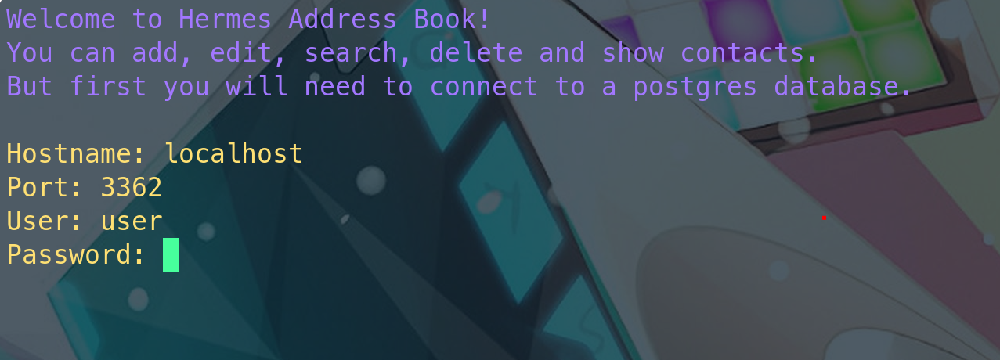
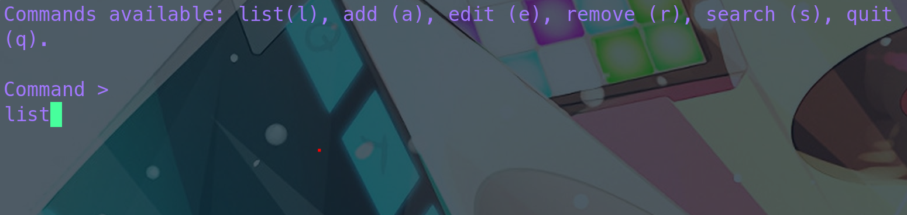
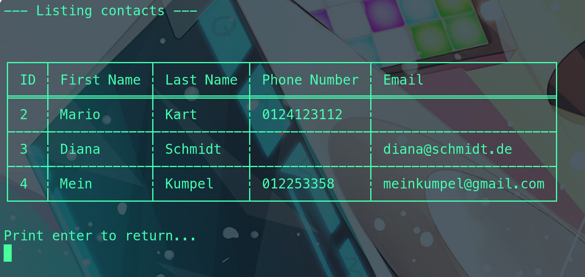

# Hermes address book





A simple CLI tool to add, list, edit, remove and search contacts.

# Prerequisites

- A running postgres server with a database called 'address_book' (use `docker compose up -d` for local development)

# Installation

Local installation with cargo via

```
cargo build && cargo install --path .
```

# Usage

Start with

```
hab
```
